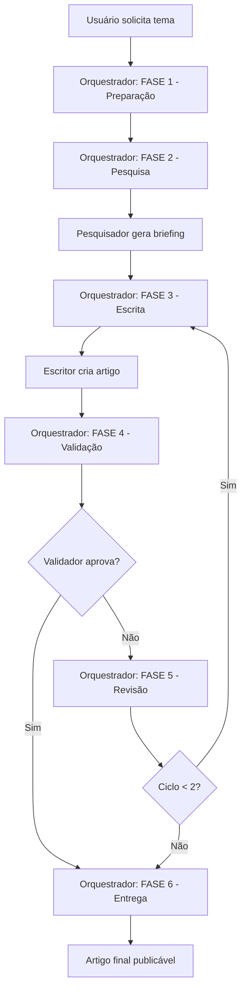

# Sistema de Agentes Copilot para Automação de Blog

Este diretório contém um sistema completo de 4 agentes especializados para automatizar a criação de artigos técnicos de alta qualidade sobre DevOps, Platform Engineering e Cloud para o site **devopsautomation.com.br**.

## 🎯 Visão Geral

O sistema funciona através de uma orquestração de agentes especializados, cada um com sua função específica:

```
Usuario
   ↓
[Orquestrador] ← Ponto de entrada (user-invokable)
   ↓
   ├─→ [Pesquisador] → Briefing de pesquisa
   ├─→ [Escritor]    → Draft do artigo
   └─→ [Validador]   → Revisão e aprovação
```

## 📁 Agentes Disponíveis

### 1. `pesquisador-devops.md`
**Papel:** Pesquisador especialista em temas técnicos

- **Invocável pelo usuário:** ❌ Não (apenas pelo orquestrador)
- **Modelo:** Claude Opus 4.6 (copilot)
- **Ferramentas:** `read`, `search`
- **Função:** Realiza pesquisa profunda sobre o tema, identifica curso relacionado, e gera briefing estruturado

**Saída:** `/workspace/{projeto}/intermediate/pesquisa.md`

---

### 2. `escritor-artigos.md`
**Papel:** Escritor especialista em conteúdo técnico autêntico

- **Invocável pelo usuário:** ❌ Não (apenas pelo orquestrador)
- **Modelo:** Claude Opus 4.6 (copilot)
- **Ferramentas:** `read`, `edit`
- **Função:** Transforma pesquisa em artigo envolvente, humano e livre de buzzwords de IA

**Características:**
- 2000-4500 palavras em português brasileiro
- Zero buzzwords (game changer, disruptivo, no cenário atual, etc.)
- Zero emojis (exceto 👉 no link do curso)
- Tom humano com opiniões pessoais e variação de estilo

**Saída:** `/workspace/{projeto}/intermediate/artigo-draft.md`

---

### 3. `validador-artigos.md`
**Papel:** Guardião da qualidade - validação rigorosa

- **Invocável pelo usuário:** ❌ Não (apenas pelo orquestrador)
- **Modelo:** Claude Opus 4.5 (copilot)
- **Ferramentas:** `read`, `edit`
- **Função:** Valida artigo contra 6 categorias de qualidade

**Categorias de Validação:**
1. ✅ **Formatação Docusaurus** (15%)
2. ✅ **Link do Curso** (10%)
3. ✅ **Qualidade do Conteúdo** (25%)
4. ✅ **Tom Humano** (30% - critério mais importante)
5. ✅ **SEO** (10%)
6. ✅ **Buzzwords/Emojis** (10% - tolerância zero)

**Aprovação:** ≥85% com categorias D e F obrigatoriamente aprovadas

**Saída:** `/workspace/{projeto}/intermediate/revisao.md`

---

### 4. `orquestrador-blog.md`
**Papel:** Coordenador principal do sistema

- **Invocável pelo usuário:** ✅ Sim (ponto de entrada)
- **Ferramentas:** `agent`, `read`, `search`, `edit`
- **Agentes:** `pesquisador-devops`, `escritor-artigos`, `validador-artigos`
- **Função:** Coordena os 3 agentes especializados em 6 fases

**Processo:**
1. **Preparação** - Configura workspace e lê contexto
2. **Pesquisa** - Aciona pesquisador
3. **Escrita** - Aciona escritor (com ou sem código)
4. **Validação** - Aciona validador
5. **Revisão** - Loop de correções (máx 2 ciclos)
6. **Entrega** - Gera artigo final e resumo

**Saída:** `/workspace/{projeto}/output/YYYY-MM-DD-slug.md`

## 🚀 Como Usar

### Uso Básico

```
@orquestrador-blog Crie um artigo sobre [TEMA]
```

**Exemplos:**

```
@orquestrador-blog Crie um artigo sobre Platform Engineering em 2025
```

```
@orquestrador-blog Crie um artigo sobre Terraform Security com Checkov e Trivy
```

```
@orquestrador-blog Crie um tutorial de CI/CD com GitHub Actions - inclua exemplos práticos
```

### Artigo COM Código vs SEM Código

**Artigo analítico (sem código):**
```
@orquestrador-blog Crie um artigo sobre carreira em DevOps
```
→ Orquestrador instrui escritor a NÃO incluir code blocks

**Artigo tutorial (com código):**
```
@orquestrador-blog Crie um tutorial de Terraform - inclua exemplos práticos de código
```
→ Orquestrador instrui escritor a incluir code blocks funcionais

## 📚 Mapeamento de Cursos

O sistema identifica automaticamente qual curso do site se relaciona com o tema:

| Palavras-chave | Curso |
|----------------|-------|
| terraform, iac, hcl, checkov, trivy, opa | **Terraform Automação** |
| ia, chatgpt, gemini, claude, prompt, llm | **AI DevOps Automação** |
| github actions, ci/cd, pipeline, workflow | **GitHub Actions Automação** |
| devops, platform engineering, sre, carreira | **DevOps Automação (geral)** |

## 📂 Estrutura de Workspace

Para cada artigo, o sistema cria:

```
/workspace/{slug}/
├── intermediate/
│   ├── pesquisa.md      # Briefing de pesquisa
│   ├── artigo-draft.md  # Draft do artigo
│   └── revisao.md       # Parecer de validação
└── output/
    ├── YYYY-MM-DD-slug.md  # Artigo final
    └── RESUMO.md           # Resumo da produção
```

## ✅ Checklist de Qualidade

Todo artigo produzido pelo sistema garante:

- [x] **Formatação Docusaurus válida**
  - Front matter completo (title, description, authors, tags, date)
  - Title máx 70 chars
  - Description 150-160 chars
  - 8-12 tags SEO-friendly

- [x] **Link do curso presente e correto**
  - Logo após H1
  - Formato: `👉 [Acesse o curso ...](...)`

- [x] **Qualidade do conteúdo**
  - Mínimo 2000 palavras
  - 4-6 seções H2
  - Dados concretos e específicos
  - Exemplos práticos

- [x] **Tom humano e autêntico**
  - Zero buzzwords de IA
  - Zero emojis (exceto 👉 no link)
  - Variação no estilo
  - Opiniões pessoais

- [x] **SEO otimizado**
  - Keywords estratégicas
  - Tags cobrindo variações
  - Description chamativa

## 🚫 Lista de Buzzwords Proibidas

O validador rejeita automaticamente artigos que contenham:

**Mistura desnecessária inglês/português:**
- toolchains, workflows escaláveis, best practices, game changer, deep dive, hands-on, end-to-end, state-of-the-art, bleeding edge, cutting edge, mindset, approach, leverage, framework (genérico)

**Hipérboles vazias:**
- revolucionário, transformador, disruptivo, poderoso, robusto, impressionante, incrível, fantástico (sem contexto)

**Chavões de IA:**
- "no cenário atual", "é importante destacar que", "vale ressaltar", "em um mundo cada vez mais", "na era da transformação digital", ecossistema, sinergia, paradigma, holístico

**Corporativês:**
- alavancando, potencializando, otimizando (genérico), escalando (fora de contexto), democratizando

**Nota:** Termos técnicos legítimos (Terraform, Kubernetes, CI/CD, deploy, pipeline) são permitidos.

## 📊 Ciclo de Vida de um Artigo



## 📝 Exemplo de Execução

**Input do usuário:**
```
@orquestrador-blog Crie um artigo sobre Terraform Security SAST em 2025
```

**Output do sistema:**

1. **Workspace criado:** `/workspace/terraform-security-sast-2025/`

2. **Pesquisa concluída:**
   - Curso identificado: Terraform Automação
   - Briefing: 8 seções com dados concretos
   - Keywords: 12 sugestões SEO

3. **Artigo escrito:**
   - 2.847 palavras
   - 5 seções H2
   - Zero buzzwords
   - Tom humano confirmado

4. **Validação:**
   - Pontuação: 91%
   - Status: APROVADO
   - 0 correções necessárias

5. **Entrega:**
   - Arquivo: `2026-02-15-terraform-security-sast-2025.md`
   - Pronto para publicação em `blog/`

## 🔧 Configurações

### Front Matter Padrão

```yaml
---
title: "Título do Artigo (máx 70 chars)"
description: "Meta description SEO otimizada (150-160 chars)"
authors: [Ieso]
tags:
  - "tag 1"
  - "tag 2"
  # ... 8-12 tags total
date: YYYY-MM-DD
---
```

### Cursos Disponíveis

1. **Terraform Automação**
   - Link: `https://www.udemy.com/course/terraform-automacao/`
   - Rota: `/udemy/terraform-automacao`

2. **AI DevOps Automação**
   - Link: `https://www.udemy.com/course/devops-automacao-sem-enrolacao/?referralCode=28E4F89140C44D63D605`
   - Rota: `/udemy/ai-devops-automacao`

3. **GitHub Actions Automação**
   - Link: `https://www.udemy.com/course/github-actions-automacao/`
   - Rota: `/udemy/github-actions-automacao`

## 📖 Recursos Adicionais

- **Repositório:** `iesodias/devops-automation-site`
- **Blog path:** `blog/`
- **Authors config:** `blog/authors.yml`
- **Tags config:** `blog/tags.yml`
- **Site:** [devopsautomation.com.br](https://devopsautomation.com.br)

## 🎯 Objetivos do Sistema

1. ✅ **Automatizar produção** de artigos técnicos de alta qualidade
2. ✅ **Garantir tom humano** e autêntico (não soar como IA)
3. ✅ **Otimizar para SEO** sem comprometer qualidade
4. ✅ **Integrar com cursos** de forma natural e relevante
5. ✅ **Manter consistência** de padrão e formatação
6. ✅ **Reduzir tempo** de produção de horas para minutos

## 📋 Próximos Passos após Geração

Quando o orquestrador entregar o artigo final:

1. **Revisar o artigo** em `/workspace/{slug}/output/YYYY-MM-DD-slug.md`
2. **Copiar para o blog:**
   ```bash
   cp /workspace/{slug}/output/YYYY-MM-DD-slug.md blog/
   ```
3. **Commit e push:**
   ```bash
   git add blog/YYYY-MM-DD-slug.md
   git commit -m "Adiciona artigo: [título]"
   git push
   ```
4. **Aguardar deploy** automático do Docusaurus

---

**Desenvolvido para:** devopsautomation.com.br  
**Autor dos Artigos:** Iêso Dias (Instrutor DevOps & Cloud)  
**Repositório:** iesodias/devops-automation-site
